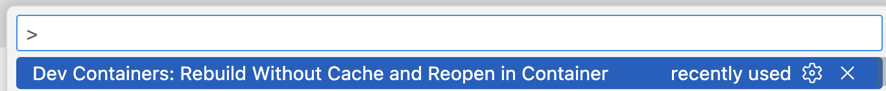

## How to reproduce the test

1. Have `Docker`, `Docker Compose`, and `VS Code` installed
1. Build feathr docker image
    ```bash
    cd ~ && \
    git clone git@github.com:feathr-ai/feathr.git \
    cd feathr && \
    docker build -f FeathrRegistry.Dockerfile -t feathr-ui-and-registry-v1 . && \
    cd .. && \
    rm -rf feathr
    ```
1. Open this repo in VS Code
    ```bash
    code feature-store-task
    ```
1. Run docker compose
    ```bash
    docker compose up -d
    ```
1. Type `CMD + Shift + P` and choose `Dev Containers: Rebuild Without Cache and Reopen in Container`
    


## TO DO
1. [x] Сбилдить Feathr Registry & UI в docker image  
1. [x] Сделать docker compose HDFS + Feathr  
1. [ ] Возможность использовать Feathr как Semantic Layer  
    1. [ ] Получить план запроса feature таблицы из Feathr, а выполнять из своей spark session  
1. [ ] Регистрация features после кастомной материализации
1. [ ] Переиспользование features
    1. [ ] Импортировать код зарегистрированных features и определить на них новую DerivedFeature

## Additional information

- Run official quickstart
    ```bash
    docker run -it --rm   -p 8889:8888   -p 3000:80   -p 7082:7080   -e GRANT_SUDO=yes   -v /Users/alexeynazarov/Desktop/feature-store-task/feathr_data:/home/jovyan/work/product_recommendation feathrfeaturestore/feathr-sandbox:releases-v1.0.0
    ```
    - Feature REgistry UI: `localhost:3000`
    - Notebook guide: `localhost:8889`
